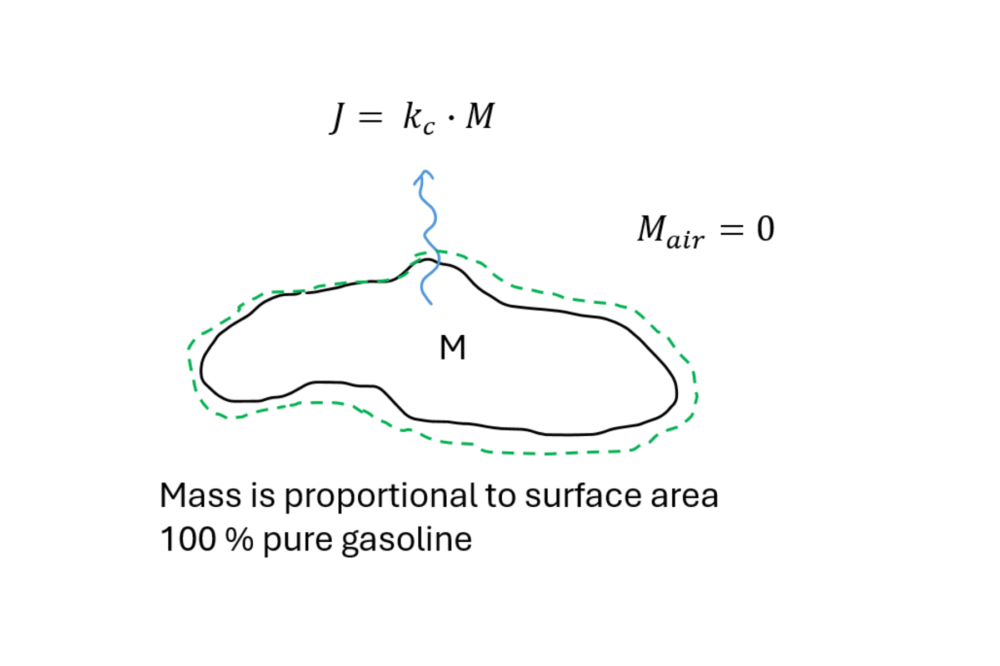
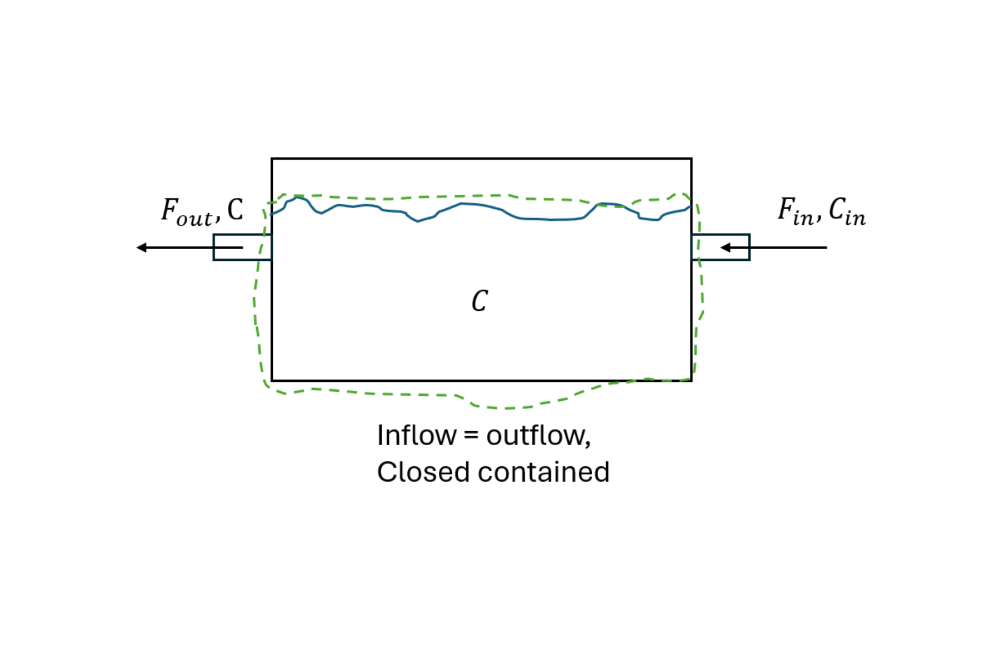
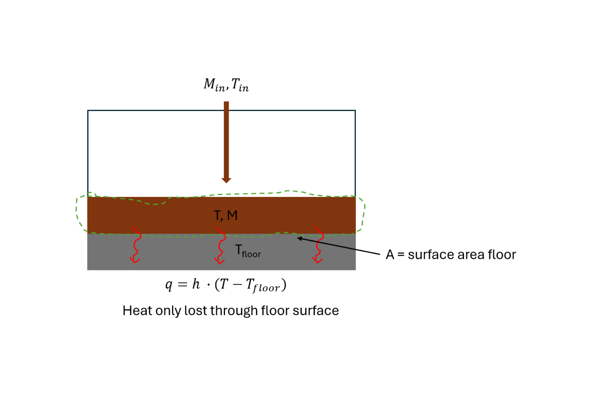

Problem 1

Our conceptual model for the gasoline spillage.

{#fig-gasoline fig-alt="Sketch of gasoline spillage"}

The general mass balance for any system is: 

$Accumulation = in - out + generated - consumed$

There is no generation or consumption, there is nothing going into the gasoline puddle, but there is evaporation, which would be the "out" term. We have to consider the state variable. We will assume that the gasoline puddle is made of 100% gasoline, so the mass of the puddle is our state variable.

$Accumulation = -out$

Evaporation can only happen from the surface of the puddle. If the puddle is very flat and keeps the same height, but only shrink in diameter as it evaporates, we can assume the surface is proportional to the mass of the puddle. So the evaporation rate would be a proportionality constant multiplied with the mass of the puddle.

$out = k \cdot M$

$\frac{dM}{dt} = -k \cdot M$

Problem 2

Conceptual model of saltwater tank

{#fig-saltwater fig-alt="Sketch of tank with saltwater"}

The general mass balance for any system is: 

$Accumulation = in - out + generated - consumed$

In terms of mass of salt: There is no generation or consumption of salt so:

$\frac{dM}{dt} = F_{in} \cdot C_{in} - F_{out} \cdot C$

Rather than mass of salt we want concentration of salt as state variable, we use a linking equation for this since we know that:

$\frac{dM}{dt} = V \cdot \frac{dC}{dt}$

$V \cdot \frac{dC}{dt} = F_{in} \cdot C_{in} - F_{out} \cdot C$

Finally:

$\frac{dC}{dt} = \frac{(F_{in} \cdot C_{in} - F_{out} \cdot C)}{V}$

We need to know the flow rate of water in (assuming it is the same rate out), the volume of water in the reactor, and the concentration of salt in the inlet water. Finally to actually solve the problem we need the initial condition for salt concentration in the water in the tank to start with. We cannot see this directly from the differential equation, but it would be the constant that appears from integrating the ODE.

Problem 3

The conceptual model of the slurry cooling: 

{#fig-slurry-cool fig-alt="Sketch of slurry cooling in pig barn"}

The general energy balance for any system is:

$Accumulation = in - out + generated - consumed$

The state variable we want is temperature of the slurry in the pit.

There is no generation or consumption of energy, and we will ignore heat from the pigs and any excreted slurry to keep things simple. But there will be heat loss due to the cooling technology. This will be the "out" term. Cooling is lost from below the slurry, with some defined surface area, A (but this was hard to know, when you are not an expert in climate technologies for pig barns..).

$out = A \cdot h \cdot (T_{slurry} - T_{floor})$

$\frac{dQ}{dt} = - A \cdot h \cdot (T_{slurry} - T_{floor})$

Then convert $\frac{dQ}{dt}$ to $\frac{dT}{dt}$ using the heat capacity of the slurry in the pit, $C_p$, and the mass of slurry in the pit, $M_{slurry}$

$Q = M_{slurry} \cdot C_p \cdot T_{slurry}$

differentiation gets us to

$\frac{dQ}{dt} = M_{slurry} \cdot C_p \cdot \frac{dT}{dt}$

$M_{slurry} \cdot C_p \cdot \frac{dT}{dt} = - A \cdot h \cdot (T_{slurry} - T_{floor})$

This is all good if we had no heat input from excreted slurry. But we do, which makes it slightly more complicated.

$In = Q_{in} = M_{in} \cdot C_p \cdot T_{in}$

But we get in trouble because with flow of slurry into the pit, $M_{slurry}$ will change over time. Then we need another equation to describe the change in $M_{slurry}$.

$\frac{dM}{dt} = M_{in}$

and we cannot do this anymore:

$\frac{dQ}{dt} = M_{slurry} \cdot C_p \cdot \frac{dT}{dt}$

because $M_{slurry}$ is changing over time (not a constant). With the product rule of differentiation:

$\frac{dQ}{dt} = M_{slurry} \cdot C_p \cdot \frac{dT}{dt} + \frac{dM}{dt} \cdot C_p \cdot T_{slurry}$

So putting together we have:

$M_{slurry} \cdot C_p \cdot \frac{dT}{dt} + \frac{dM}{dt} \cdot C_p \cdot T_{slurry} = in - out$

$M_{slurry} \cdot C_p \cdot \frac{dT}{dt} + \frac{dM}{dt} \cdot C_p \cdot T_{slurry} = M_{in} \cdot C_p \cdot T_{in} - A \cdot h \cdot (T_{slurry} - T_{floor})$

Then isolating $\frac{dT}{dt}$ and putting substituting $\frac{dM}{dt}$ with $M_{in}$

$M_{slurry} \cdot C_p \cdot \frac{dT}{dt} = M_{in} \cdot C_p \cdot T_{in} - A \cdot h \cdot (T_{slurry} - T_{floor}) - M_{in} \cdot C_p \cdot T_{slurry}$

$\frac{dT}{dt} = \frac{M_{in}}{M_{slurry}} \cdot T_{in} - \frac{A \cdot h \cdot (T_{slurry} - T_{floor})}{M_{slurry} \cdot C_p} - \frac{M_{in}}{M_{slurry}} \cdot T_{slurry}$

Collecting terms.

$\frac{dT}{dt} = \frac{M_{in}}{M_{slurry}} \cdot (T_{in}-T_{slurry}) - A \cdot h \cdot \frac{T_{slurry} - T_{floor}}{(M_{slurry} \cdot C_p)}$

and remember that we need to track $M_{slurry}$ over time, so we also need the equation for the governing equation for that one.

$\frac{dM}{dt} = M_{in}$
