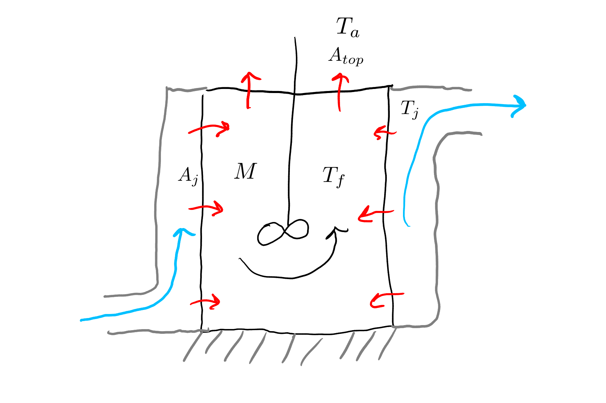
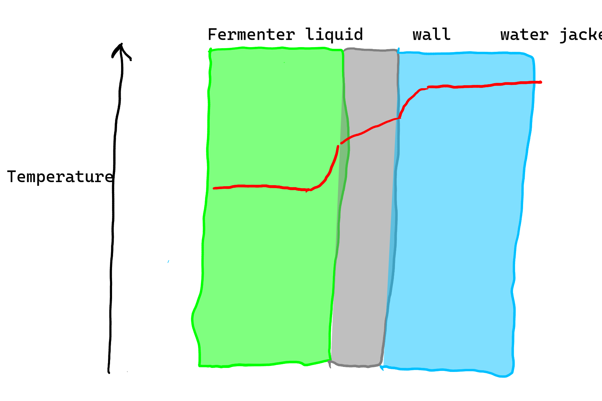

# Heat transfer exercises

1. You have a fermenter that is heated to around 45 $\degC$ using a water jacket. 
   The water flowing into the water jacket has a constant temperature of 50 $\degC$.
   Develop and implement a steady-state model to predict fermenter temperature based on heating water flow and relevant parameters and system characteristics.
   Feel free to make simplifications along the way (you should!), but state them.

**Solution**

## 1. Conceptual model
Our state variable is the temperature (or thermal energy content) of liquid in the fermenter.

{#fig-ferm-sol1 fig-alt="Sketch of heated fermenter"}

Heat from warm water in the water jacket is transfered through convection (fluids) and conduction (wall) to reach the fermenter liquid. 

If we assume the only heat transfered to/from the fermenter is from the water in the water jacket, i.e., assume no heat loss, we have a pretty boring and unrealistic model. 
The steady-state fermenter temperature would simply be the water jacket water temperature.
So here we will have heat loss from an uninsulated top, but no significant heat loss from the bottom, where the fermenter is assumed to be resting on some insulating material.

We will assume the water jacket temperature is uniform and constant. 
This is only realistic if the flow rate is high enough that any cooling is minor. 

And we'll assume that the temperature of the mixture in the fermenter is uniform.
The overall heat transfer coefficient for both locations includes resistance from both convection and conduction (that is why we use $U$ and not $h$).

{#fig-ferm-sol2 fig-alt="Temperature profile"}

## 2. Balance/conservation equations

rate of energy accumulation = rate of heat transfer in from the jacket - rate of heat loss from the top

## 3. Constitutive equation

Overall heat transfer form of Newton's law of cooling:

$$
q_j = U_j \cdot (T_{j} - T_{f}),
$$

and

$$
q_t = - U_t \cdot (T_{f} - T_{a}).
$$

## 4. Linking equations

Here we have to link heat energy and temperature.

$$
\frac{dT}{dt} = \frac{\dot{Q}} {c_p \cdot M}
$$

## 5. Initial or boundary conditions

We are aiming for a steady-state model so there are no initial conditions to worry about.
There are fixed jacket water $T_j$ and air temperatures $T_a$.

## 6. Governing equation

Now to put it all together.
Let's combine the equations from above.

From 2 and 3:

$$
\dot{Q} = A_j \cdot U_j \cdot (T_{j} - T_{f}) - A_t \cdot U_t \cdot (T_{f} - T_{a}).
$$

Substituting that into the equation in 4 gives a GE:

$$
\frac{dT}{dt} = \frac{A_j \cdot U_j \cdot (T_{j} - T_{f}) - A_t \cdot U_t \cdot (T_{f} - T_{a})} {c_p \cdot M}.
$$

## 7. Solution

The problem asks for a steady-state model.
For that, we set the GE to 0 and simplify, which gives:

$$
A_j \cdot U_j \cdot (T_{j} - T_{f}) = A_t \cdot U_t \cdot (T_{f} - T_{a}).
$$

Notice how the mass of fermenter fluid drops out?
It is irrelevant at steady-state.
Now, it would certainly affect the time required for attaining steady-state!

Then rearrange to solve for $T_f$:

$$
T_f = \frac{A_t \cdot U_t \cdot T_a + A_j \cdot U_j \cdot T_j} {A_j \cdot U_j + A_t \cdot U_t}.
$$

And there is a steady-state solution.

## Implementation

Let's implement this steady-state model in Python as a stand-alone module.

```{.python filename="ferm_mod.py"}

```

The actual solution (equation above) is simple.
In the code it is spread across a few lines for clarity.
This is good practice then an expression has a lot of terms.
Note that the intermediate variables (`num` and `dem` above) do not need to have any physical interpretation.

Here are some predictions.

```{python}
import ferm_mod as fm
```

First, using some best guesses for parameter values.
Really, the $U$ terms should be estimated from individual components.
But because the convection terms probably dominate the total resistance, we can use convection coefficient estimates from the book.
For the top, we have free convection through a gas (air), so we might expect something in the 10s.
Between the jacket and fermenter mix, we have two liquids, so something in the 100s is reasonable.

```{python}
fm.ferm_temp(temp_jack=50, temp_air=20, u_jack=200, u_top=10, area_jack=0.1, area_top=0.05)
```

So with a low $U$ for the top, the fermenter temperature is close to the jacket temperature.
That makes sense.

What happens if we match the heat transfer coefficients and areas?

```{python}
fm.ferm_temp(temp_jack=50, temp_air=20, u_jack=10, u_top=10, area_jack=0.1, area_top=0.1)
```

That makes sense as well.
But it is physically unrealistic to match the coefficients.

If we shut off the heat transfer from the jacket?

```{python}
fm.ferm_temp(temp_jack=50, temp_air=20, u_jack=0, u_top=10, area_jack=0.1, area_top=0.1)
```

Right.

Can you think of other scenarios worth trying?
