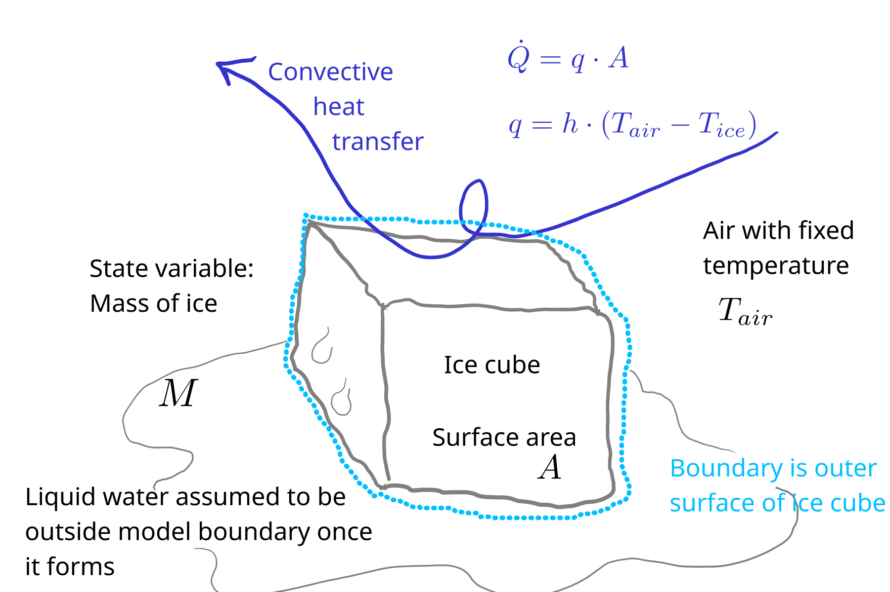

# 2. Melting ice model

2. How long will it take for an ice cube to melt once it is exposed to room temperature air?
   Follow the model formulation steps we covered in class to develop a model to simulate the processes.
   You can use an analytical or numerical approach.
   Predict the time required for melting for a couple ice cube sizes.

**Solution**

## 1. Conceptual model

A cube of ice is exposed to the air. 
From convective heat transfer from the air to the ice, the ice melts. 
We will assume all the melting occurs at the surface. 
This seems reasonable, because heat transfer requires a gradient, and heat energy is only transfered *down* a gradient, and the ice temperature is initially below freezing, so a location farther from the surface can never have more available heat energy than one closer. 

{#fig-ice-sol1 fig-alt="Conceptual model of melting ice model"}

As the ice cube melts, the exposed surface area changes, and this will be included in the model. 

We'll assume there is no heat transfer through the bottom surface. This could be a bad assumption depending on the experimental system! 
For example, conduction through a metal surface could be a major route of heat transfer.

And we'll assume the (remaining) ice is always at the freezing point. 
Once it gets above that temperature, it is no longer within the model boundary.

## 2. Balance/conservation equations

rate of energy accumulation = rate of convective heat transfer in 

Here we have a transfer of sensible heat energy but it is converted to latent heat through melting (a phase change).

## 3. Constitutive equation

Newton's law of cooling (even though it applies to heating here).

$$
q = h \cdot (T_{air} - T_{ice})
$$

## 4. Linking equations

Here we have to go from energy accumulation to the change in our state variable $M$.
We can do that through the heat of fusion $\Delta H_f$.

$$
\frac{dM}{dt} = - \frac{Q}{\Delta H_f}
$$

And remember that area $A$ changes over time.
So we need some kind of link between $M$ and $A$.
For that, we need to assume some geometric shape.
A cube and a hemisphere both seem to be reasonable assumptions.
Either way, we will need:

$$
M = \rho \cdot V.
$$

And for a hemisphere, we have:

$$
V = \frac{2}{3} \cdot \pi \cdot r^{3}, 
$$

and

$$
A = 2 \cdot \pi \cdot r^{2}.
$$

Rearranging the equation for $V$ gives this for radius:

$$
r = (\frac{3}{2 \pi} \cdot V )^{\frac{1}{3}}.
$$

And substituting into the area equation:

$$
A = 2 \cdot \pi \cdot (\frac{3}{2 \pi} \cdot V)^{\frac{2}{3}}.
$$

Later we will use $\frac{M}{\rho}$ in place of $V$

Note that this symbolic math stuff may be much easier to do with pencil and paper than on a computer (at least it is for me)!

## 5. Initial or boundary conditions

Initially we will have some mass $M_0$.
There is a fixed air temperature $T_{air}$.

## 6. Governing equation

Now we have to put it all together.

As shown in part 4 above, we can link the derivative of our state variable to heat energy accumulation $Q$.
And we can get $Q$ from the constitutive equation in 3, like this:

$$
Q = A \cdot q
$$

where $q$ comes from

$$
q = h \cdot (T_{air} - T_{ice}).
$$

For a numeric model it can be easier and safer (less risk of errors) to implement the calculations stepwise, with intermediate variables.
It also makes the code easier to understand.

So, starting with the current value of $M$, we get the exposed area from

$$
A = 2 \cdot \pi \cdot (\frac{3}{2 \pi} \cdot \frac{M}{\rho})^{\frac{2}{3}}.
$$

And then heat flux:

$$
q = h \cdot (T_{air} - T_{ice}).
$$

Then heat flow:

$$
Q = A \cdot q
$$

And finally, the ODE:

$$
\frac{dM}{dt} = - \frac{Q}{\Delta H_f}.
$$

## 7. Solution

The equations in 6 above are used in the ice_mods module (see file `ice_mods.py`).
Here are the contents.

```{.python filename="ic_mods.py"}

```

Here are some predictions.


```{python}
# Python packages
import numpy as np
import matplotlib.pyplot as plt
from importlib import reload

# Our module, loaded from the file ice_mods.py
import ice_mods as im
```

We'll start with 50 g ice cubes and an air temperature of 20 $\degC$.
For the convection heat transfer coefficient, we'll pick a value toward the lower end of the range from the parameter value appendix in the book, because we can assume this is free convection.

```{python}
reload(im)

pred01 = im.melt(
    mass_0 = 0.05, 
    temp_air = 20, 
    h = 50, 
    t_range = (0, 3 * 3600),
    t_step = 60
)

```

Let's plot model output.

```{python}
plt.plot(pred01["t"] / 60, 1000 * pred01["m"])
plt.xlabel("Time (min)")
plt.ylabel("Ice mass (g)")
```

Now for multiple sizes, say 10, 50, and 100 g.
Note that a 100 g ice cube (hemisphere) would be quite large, with a 5 cm radius!


```{python}
pred_10g = im.melt(
    mass_0 = 0.01, 
    temp_air = 20, 
    h = 50, 
    t_range = (0, 3 * 3600),
    t_step = 60
)

pred_50g = im.melt(
    mass_0 = 0.05, 
    temp_air = 20, 
    h = 50, 
    t_range = (0, 3 * 3600),
    t_step = 60
)

pred_100g = im.melt(
    mass_0 = 0.1, 
    temp_air = 20, 
    h = 50, 
    t_range = (0, 3 * 3600),
    t_step = 60
)

```

```{python}
plt.plot(pred_10g["t"] / 60, 1000 * pred_10g["m"], label = '10 g')
plt.plot(pred_50g["t"] / 60, 1000 * pred_50g["m"], label = '50 g')
plt.plot(pred_100g["t"] / 60, 1000 * pred_100g["m"], label = '100 g')
plt.legend()
plt.xlabel("Time (min)")
plt.ylabel("Ice mass (g)")
```

And there we go.
Do the results seem plausible?

How about an analytical solution?
For that we really do need a single GE.

We can simplify the equation for area a bit, to isolate $M$:

$$
A = 2 \cdot (\frac{3}{2})^{\frac{2}{3}} \cdot \rho^{-\frac{2}{3}} \cdot \pi^{\frac{1}{3}} \cdot M^{\frac{2}{3}}.
$$


Then just substitute.

$$
\frac{dM}{dt} = - 2 \cdot (\frac{3}{2})^{\frac{2}{3}} \cdot \rho^{-\frac{2}{3}} \cdot \pi^{\frac{1}{3}} \cdot \frac{h \cdot (T_{air} - T_{ice})}{\Delta H_f} \cdot M^{\frac{2}{3}}.
$$

That's our GE.
Everything on the left is a constant, so we'll call it $k$ to make the next steps easier.

$$
\frac{dM}{dt} = - k \cdot M^{\frac{2}{3}}.
$$

It is possible to solve this by separating variables and integrating both sides (but don't ask me to do it live!)

Ultimately, you can get:

$$
M(t) = \left (-\frac{k \cdot t}{3} + M_0 ^{\frac{1}{3}} \right ) ^3
$$

It can be used, although it gives a strange result for long times.
Give it a try if you are interested.


