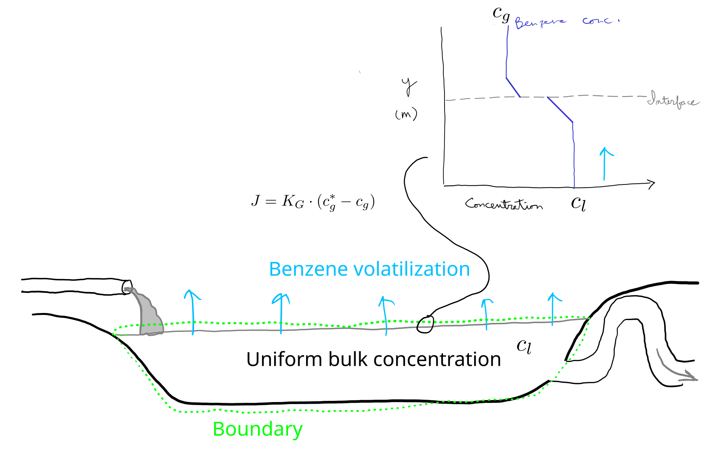

# Benzene solution

2. Develop a steady-state or dynamic model for benzene volatilization from an open industrial wastewater lagoon and implement it in Python.
   You can assume a negligible bulk air concentration.
   The bulk concentration in the lagoon is 10 $\mgpl$, which corresponds to an vapor-phase equilibrium concentration of about 2 $\gpmc$ (that is based on Henry's law).
   Most of the resistance to mass transfer comes from the water.
   You can assume the overall mass transfer coefficient in air phase units, $K_G$, is 0.001 $\mps$.
   If the lagoon is 1 m deep, predict the relative hourly loss with your model.
   Do you expect it to be constant over time?

## 1. Conceptual model

In our conceptual model, we have uniform benzene concentrations in the bulk air and wastewater.
If we take a dynamic batch approach, where we have some initial quantity of benzene that is lost over time, the benzene concentration in wastewater will decrease over time, but we will assume the it is uniform within the lagoon at any time. 
This is a reasonable assumption if the majority of mass transfer resistance comes from the interface.
In very still water where mass transfer is diffussion-controlled, this would not be a good assumption, but a open lagoon will be mixed by wind and thermal gradients (buoyancy differences) and this assumption is commonly made.

If contaminated wastewater is continuously added and older wastewater flows out through an outlet, we can assume a uniform and constant concentration, like a completely stirred tank reactor (CSTR).
We could represent this situation with a steady-state model.

Here is a sketch of the conceptual model:

{#fig-benz-concept fig-alt="Benzene volatilization model concept"}

## 2. Balance/conservation equations

For batch, we have:

rate of accumulation in lagoon = - rate of volatilization

If we include inflow and outflow, i.e., for a steady-state model, we have:

rate of accumulation in lagoon = wastewater flow in - wastewater flow out - rate of volatilization

## 3. Constitutive equation

The appropriate constitutive equation is this one:

$$
J = k_c \cdot (c^* - c).
$$

That is right from the book.
Let's switch symbols:

$$
J = K_G \cdot (c_g^* - c_g).
$$

Here $c_g^*$ is the hypothetical gas phase concentration that would be in equilibrium with the bulk liquid phase concentration.
Of course $c_g$ is the actual ambient gas phase concentration.

## 4. Linking equations

We could argue that none are needed.

But I think we can highlight the link between the concentration used in the constituitive equation above and the total/measured concentration that is relevant to conservation:

$$
c_g^* = \frac{c_l} {H},
$$

where $H=$ Henry's law constant, dimensionless, aq:g, meaning $\gpmc$ of benzene in the gas phase over $\gpmc$ in the wastewater.

## 5. Initial or boundary conditions

In a dynamic (batch) model we'll have some initial concentration.
In a steady-state model we will solve for the steady-state solution, and don't care about an initial concentration.

## 6. Governing equation

Now we put things together.
The dynamic batch model is simpler.

The LHS of the conservation equation, which was this

rate of accumulation in lagoon = - rate of volatilization

is $\frac{dM}{dt}$, where $M=$ the mass of benzene present in the lagoon.

The RHS is based on our constitutive equation, but needs area.
Putting both in place, gives:

$$
\frac{dM}{dt} = - A \cdot K_G \cdot ( c_g^* - c_g).
$$

Maybe we want to work with concentration, not total mass.
We get there by dividing by lagoon volume:

$$
\frac{dc_l}{dt} = - \frac{A}{V} \cdot K_G \cdot ( c_g^* - c_g).
$$

If we assume vertical sides and a uniform depth, $\frac{A}{V} = $ depth, which we'll call $d$.

$$
\frac{dc_l}{dt} = - \frac{K_G \cdot ( c_g^* - c_g)} {d}.
$$

Does this make sense?
As depth increases, the rate of concentration change decreases.
As depth increases, the surface area present for a fixed volume decreases.
So it does seem to make sense.
Note that this relationship does not reflect any effect of a farther distance that benzene lower in the lagoon has to be transported prior to volatilization.
We've assumed that this process is much faster than mass transfer through the interface, and so it is not rate-limiting.

We can convert $c_g^*$ to $c_l$.

$$
\frac{dc_l}{dt} = - \frac{K_G \cdot ( \frac{c_l} {H} - c_g)} {d}.
$$

So that's our GE for the dynamic batch model.

For the steady-state model with inflow and outflow, let's start with the conservation equation:

rate of accumulation in lagoon = wastewater flow in - wastewater flow out - rate of volatilization.

Flow in and out is just the product of concentrations and volumetric flow rate.
So we have:

$$
\frac{dM}{dt} = c_{l,0} \cdot \dot{V} - c_l \cdot \dot{V} - A \cdot K_G \cdot ( c_g^* - c_g).
$$

Simplifying,

$$
\frac{dM}{dt} = \dot{V} \cdot ( c_{l,0} - c_l ) - A \cdot K_G \cdot ( c_g^* - c_g).
$$

And sorting out concentration,
 
$$
\frac{dM}{dt} = \dot{V} \cdot ( c_{l,0} - c_l ) - A \cdot K_G \cdot ( \frac{c_l} {H} - c_g).
$$

That could be our governing equation.
Or, for concentration, 

$$
\frac{dc_l}{dt} = \frac {( c_{l,0} - c_l )} {\theta} - \frac {K_G} {d} \cdot ( \frac{c_l} {H} - c_g),
$$

where $\theta=$ hydraulic retention time.

Remember, with a numerical solution you can have separate expression for each term in GE.

# 7. Solution/implementation

## Numerical

The Python module `benz_nmods.py` for numerical implementation of both models.

```{.python filename="benz_nmods.py"}

```

Let's test the first, batch, model.

```{python}
import numpy as np
import matplotlib.pyplot as plt
from scipy.integrate import solve_ivp
from importlib import reload

import benz_nmods as bnm

# If needed
reload(bnm)
```

```{python}
pred01 = bnm.benzvol_batch(
    cl0=10, 
    ca=0, 
    kg=0.001, 
    depth=1,
    h=5,
    t_range = (0, 10*3600),
    t_step = 60
)
```

The default for Henry's law constant comes from the information in the problem description: $\frac{10 ~ \gpmc} {2 ~ \gpmc} = 5$.

```{python}
plt.plot(pred01["t"] / 3600, pred01["cl"])
plt.xlabel("Time (hours)")
plt.ylabel("Benzene conc. (g/m3)")
```

We can use the model to answer the question about relative hourly loss.
We'll interpret the question as one about total loss over 1 hour, not the instantaneous rate of loss.
To make it easier, we'll switch to an hourly step and run the model for a day.

```{python}
pred02 = bnm.benzvol_batch(
    cl0=10, 
    ca=0, 
    kg=0.001, 
    depth=1,
    h=5,
    t_range = (0, 24*3600),
    t_step = 3600
)
```

```{python}
plt.plot(pred02['t'] / 3600, pred02['cl'])
plt.xlabel('Time (hours)')
plt.ylabel("Benzene conc. (g/m3)")
```

Here is the relative hourly loss:

```{python}
np.diff(pred02['cl']) / pred02['cl'][:-1]
```

(Do you understand the `diff()` function and the slicing?
Be sure that you do!)

That's a 50% loss per hour--quite high!
Benzene is very volatile.

Should we expect it to change over time?
No. 
The emission rate is proportional to the benzene concentration in wastewater.
See the GE for this!

How about the model with flow in and out?

```{python}
import numpy as np
import matplotlib.pyplot as plt
from scipy.integrate import solve_ivp

import benz_nmods as bnm
```

We'll use the same inputs as in the first example, plus a retention time of 1 d.

```{python}
pred03 = bnm.benzvol_flow(
    cl0=10, 
    ca=0, 
    kg=0.001, 
    depth=1,
    h=5,
    hrt=86400,
    t_range = (0, 10*3600),
    t_step = 60
)
```

```{python}
plt.plot(pred03["t"] / 3600, pred03["cl"])
plt.xlabel("Time (hours)")
plt.ylabel("Benzene conc. (g/m3)")
```

Notice how the concentration no longer tends toward zero?

Calculating the relative rate of volatilization is a little trickier for this model, but not too difficult.
Can you do it?

## Analytical

Let's start with the batch case, with no inflow or outflow.
Here is our governing equation.

$$
\frac{dc_l}{dt} = - \frac{K_G \cdot ( \frac{c_l} {H} - c_g)} {d}.
$$

You should have an idea that this is an exponential model.
So to solve it, we need to get it in this form (from section 3.3 in the book):

$$
\frac{dx}{dt} = \lambda \cdot x.
$$

One way forward is to assume now that $c_g$, the ambient concentration of benzene in air, is negligible and omit it.
Let's do that here first, for simplicity.
So we have

$$
\frac{dc_l}{dt} = - \frac{K_G \cdot  \frac{c_l} {H}} {d}.
$$

Rearranging a bit for clarity:

$$
\frac{dc_l}{dt} = - \frac{K_G} {H \cdot d} \cdot c_l.
$$

So here we can see that our rate constant is: 
$$ 
\lambda = - \frac{K_G} {H \cdot d} .
$$

And here is a solution:

$$
c_l = c_{l,0} \cdot e^{( - \frac{K_G} {H \cdot d} )}
$$

This solution is implemented here in the `benzvol_batch_an()` function:

```{.python filename="benz_amods.py"}

```

```{python}
import numpy as np
import matplotlib.pyplot as plt
from scipy.integrate import solve_ivp
from importlib import reload

import benz_amods as bam

# If needed
reload(bam)
```

```{python}
pred01a = bam.benzvol_batch(
    cl0=10, 
    ca=0, 
    kg=0.001, 
    depth=1,
    h=5,
    t_range = (0, 10*3600),
    t_step = 60
)
```

Do we get similar results?


```{python}
plt.plot(pred01["t"] / 3600, pred01["cl"], label = 'numerical')
plt.plot(pred01a["t"] / 3600, pred01a["cl"], linestyle = '--', label = 'analytical')
plt.legend()
plt.xlabel("Time (hours)")
plt.ylabel("Benzene conc. (g/m3)")
```


We could have left the background/ambient bit in the GE and still found an anlytical solution.
To do that we could just normalize our response variable by turning it into a concentration difference from the equilibrium concentration.
We can change the dependent variable on the LHS of our GE like this:

$$
\frac{d(c_l - c_{l,eq})}{dt} = - \frac{K_G \cdot ( \frac{c_l} {H} - c_g)} {d}.
$$

Remember that adding or subtracting a constant has no effect on the derivative.
Recognize that $c_{l,eq}) = \frac{c_g} {H}$.
You can arrive at that with an understanding of the physical system, or, by setting the RHS of our GE to 0 (do you know why you set it to 0?).

$$
 \frac{K_G \cdot ( \frac{c_l} {H} - c_g)} {d} = 0
$$

Assuming $K_G$ is not zero, we must have:

$$
 \frac{c_l} {H} - c_g = 0.
$$

Or, rearranging,

$$
 c_l = H \cdot c_g.
$$

So far, our new GE is


$$
\frac{d(c_l - H \cdot c_g)}{dt} = - \frac{K_G \cdot ( \frac{c_l} {H} - c_g)} {d}.
$$

Now, can we get the same concentration difference on the RHS?
Sure, by multiplying by $\frac{H}{H}$.

$$
\frac{d(c_l - H \cdot c_g)}{dt} = - \frac{\frac{K_G}{H} \cdot ( c_l - H \cdot c_g)} {d}.
$$

We actually turned $K_G$ into $K_L$ here.

Let's call $c_l - H \cdot c_g = y$. 
Then our GE is:

$$
\frac{dy}{dt} = - \frac{\frac{K_G}{H} \cdot y} {d},
$$

or

$$
\frac{dy}{dt} = - \frac{K_G}{H \cdot d} \cdot y.
$$

And, our rate constant here is $- \frac{K_G}{H \cdot d}$, so a solution is


$$
y = y_{0} \cdot e^{( - \frac{K_G} {H \cdot d} )}
$$

This looks like the exact same solution as for the simpler case above!
It is, but remember that our dependent variable is different. 
Plugging that back in gives this solution.

$$
c_l = (c_{l,0} - H \cdot c_g)  \cdot e^{( - \frac{K_G} {H \cdot d} )} + H \cdot c_g.
$$

We could also come up with an analytical model for the case with flow in and out.
But we would have to restrict ourselves to the steady-state solution (GE set to 0) to get a solution (or at least I would).
Can you figure it out?
