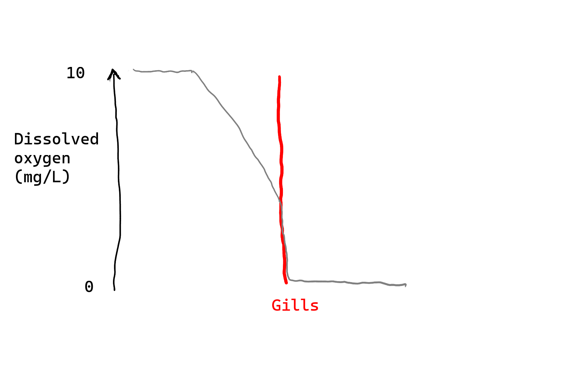
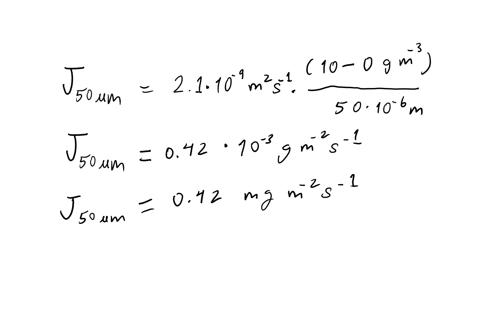

# Gill solution

1. Fish transport dissolved oxygen from water into their bloodstream through gills.
   Early work on the topic suggested that most of the resistance for this transport comes from a film of water outside the gills. 
   An increase in water flow over gills might reduce effective film thickness from 50 down to 20 μm.

   What constitutive equation can be used to express dissolved oxygen transport in this system?
   What is the smaller corresponding mass transfer coefficient value for these conditions?
   How fast can oxygen move into the blood in these two scenarios?
   
   If you struggle to find an appropriate value for $D$ you can use $2 \cdot 10^{-9} \msqps$.
   Bulk oxygen concentration depends on temperature and consumption rate, but you may assume it is 10 $\text{mg}~ \text{L}^{-1}$, which might be the case for cool, clean water.
   In the blood, free oxygen rapidly reacts with hemoglobin, so you can assume the dissolved oxygen concentration is zero.

This problem is all about *rates*.
There is no need to develop a complete model.

Here is a conceptual model of the dissolved oxygen profile based on the description.
All resistance is within the water outside the gills.
Now, we know the gradient is not in fact linear but we'll make that approximation.

{#fig-gill-sol1 fig-alt="Sketch of oxygen profile"}

The appropriate constitutive equation is some form of Fick's law.
We should be thinking about steady-state here.
And at steady-state we can use the equation for a plane wall:

$$
J = -D \cdot \frac{\Delta c}{L}.
$$

So what are the fluxes for these two conditions?
For 50 μm:

{#fig-gill-sol2 fig-alt="Solution"}

A similar calculation for 20 μm gives 1.1 $\text{g}~\text{m}^{-2}~\text{s}^{-1}$ for that condition.

The equivalent mass transfer coefficients are just this part of that plane wall equation:

$$
\frac{D}{L}.
$$

So they are $4.2 \cdot 10^{-5} ~ \text{m} ~ \text{s}^{-1}$ and $1.1 \cdot 10^{-4} ~ \text{m} ~ \text{s}^{-1}$
