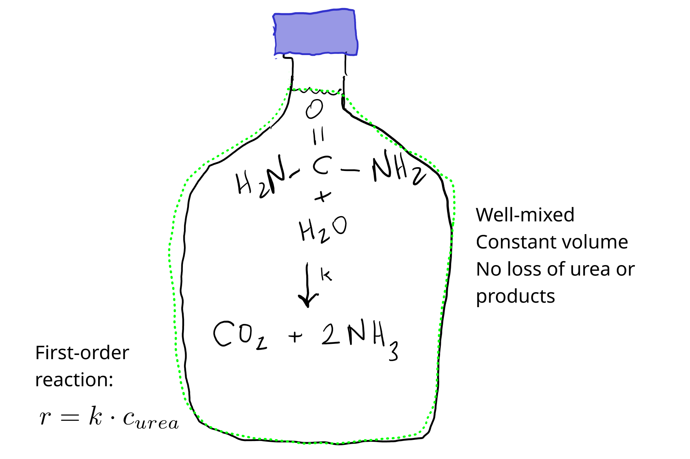

1. Formulate (pencil and paper or digital equivalent) and implement (in Python) a simple urea hydrolysis model.
   You can assume the reaction is first-order.
   Assume all products accumulate in a fixed solution volume (or solvent, water, mass).
   Plot predicted urea, ammonia, and carbon dioxide concentration over time.

**Solution**

## 1. Conceptual model

Let's get the reaction written down first.
This is copied from the book.

$$
\ce{CO(NH2)2 + H2O -> 2NH3 + CO2}
$$

Now, one state variable is of course urea.
But the problem description implies we need to track products as well.
So $\ce{NH3}$ and $\ce{CO2}$ must be included as state variables as well.

In this model let's assume we have a fixed volume of solution with urea.
The urea is hydrolyzed following first-order kinetics, and the products accumulate.

{#fig-urea-sol1 fig-alt="Conceptual model of urea hydrolysis"}

## 2. Balance/conservation equations

For urea:

rate of urea accumulation = - rate of consumption in reaction

Ammonia:

rate of $\ce{NH3}$ accumulation = rate of production in reaction

Carbon dioxide:

rate of $\ce{CO2}$ accumulation = rate of production in reaction

These could all be interpreted as in total quantity or concentration units.
Let's use mg/L, because it is a common unit, and will demonstrate some challenges with reaction model units.

## 3. Constitutive equation

Reaction is first-order, so the rate $r$ depends on a rate constant $k$ and the urea concentration.

$$
r = k \cdot c_{urea}
$$

## 4. Linking equations

We link reactant/product consumption/production rates to the overall reaction rates through the stoichiometric coefficients.

$$
\ce{CO(NH2)2 + H2O -> 2NH3 + CO2}
$$

So, for mole-based units, we would have:

$$
r_{urea} = - r
$$

$$
r_{\ce{NH3}} = 2 \cdot r
$$

$$
r_{\ce{CO2}} = r
$$

But here we are going to use mg/L, so we need to include molar mass, which we'll call $M$.
We'll keep $r$ in mol/L-s.

$$
r_{urea} = - M_{urea} \cdot r
$$

$$
r_{\ce{NH3}} = M_{\ce{NH3}} \cdot 2 \cdot r
$$

$$
r_{\ce{CO2}} = M_{\ce{CO2}} \cdot r
$$

## 5. Initial or boundary conditions

We will have to specify initial concentrations.

## 6. Governing equation

Here we need multiple governing equations.
From 2, 3, and 4 above:

$$
\frac{d~urea}{dt} = - M_{urea} \cdot k \cdot \frac{c_{urea}}{M_{urea}}
$$

But the molar mass drops out; after all this is a first-order reaction, so units don't matter as long as they match on the LHS and RHS.

$$
\frac{d ~ urea}{dt} = - k \cdot c_{urea}
$$

But for the others, they do.

$$
\frac{d \ce{NH3}}{dt} = \frac{ M_{\ce{NH3}} } {M_{urea}} \cdot 2 \cdot k \cdot c_{urea}
$$

$$
\frac{d \ce{CO2}}{dt} = \frac{ M_{\ce{CO2}} } {M_{urea}} \cdot k \cdot c_{urea}
$$

## 7. Solution

For inputs, we only need the first-order rate constant $k$ and the initial concentrations.

We could easily solve this system analytically.

But we'll start with a numerical approach.

### Numerical

```{.python filename="urea_mods.py"}

```

Here are some predictions.

```{python}
# Python packages
import numpy as np
import matplotlib.pyplot as plt
from importlib import reload

# Our module, loaded from the file ice_mods.py
import urea_mods as um
```

Reload as needed during development.
(If your Python model works the first time, you are better than me.)

```{python}
reload(um)
```

```{python}
res = um.urea_num(
    c0=[100, 0, 0], 
    k=1e-3, 
    t_range = (0, 3 * 3600),
    t_step = 60
)
```

```{python}
plt.plot(res['t'] / 60, res['c_urea'], label = 'Urea')
plt.plot(res['t'] / 60, res['c_NH3'], label = 'Ammonia')
plt.plot(res['t'] / 60, res['c_CO2'], label = 'Carbon dioxide')
plt.xlabel('Time (min.)')
plt.ylabel('Concentration (mg/L)')
plt.legend()
```

Let's do a little external verification.
Are the final concentrations reasonable?
100 mg urea is 0.00167 mol.
So we'd expect $2 \cdot 0.00167 = 0.00333$ mol $\ce{NH3}$ and 0.00167 mol $\ce{CO2}$.
That's 57 mg $\ce{NH3}$ and 73 mg $\ce{CO2}$.
Check:

```{python}
res['c_NH3'][-5:]
```

```{python}
res['c_CO2'][-5:]
```

Looks good!

### Analyical solution

Start with the urea GE:

$$
\frac{d ~ urea}{dt} = - k \cdot c_{urea}
$$

From Chapter 2, you should know that this is a solution:

$$
c_{urea} = c_{urea, 0} \cdot e^{-k \cdot t}
$$

For the others, here is a mass balance-based approach.

$$
c_{\ce{NH3}} = \frac{M_{\ce{NH3}}} {M_{urea}} \cdot 2 \cdot c_{urea, 0} \cdot (1 - e^{-k \cdot t})
$$


$$
c_{\ce{CO2}} = \frac{M_{\ce{NH3}}} {M_{urea}} \cdot c_{urea, 0} \cdot (1 - e^{-k \cdot t})
$$

Here are some results.

```{python}
# Python packages
import numpy as np
import matplotlib.pyplot as plt
from importlib import reload

# Our module, loaded from the file ice_mods.py
import urea_mods as um
```

Reload as needed during development.
(If your Python model works the first time, you are better than me.)

```{python}
reload(um)
```

```{python}
res = um.urea_ana(
    c0=[100, 0, 0], 
    k=1e-3, 
    t_range = (0, 3 * 3600),
    t_step = 60
)
```

```{python}
plt.plot(res['t'] / 60, res['c_urea'], label = 'Urea')
plt.plot(res['t'] / 60, res['c_NH3'], label = 'Ammonia')
plt.plot(res['t'] / 60, res['c_CO2'], label = 'Carbon dioxide')
plt.xlabel('Time (min.)')
plt.ylabel('Concentration (mg/L)')
plt.legend()
```


