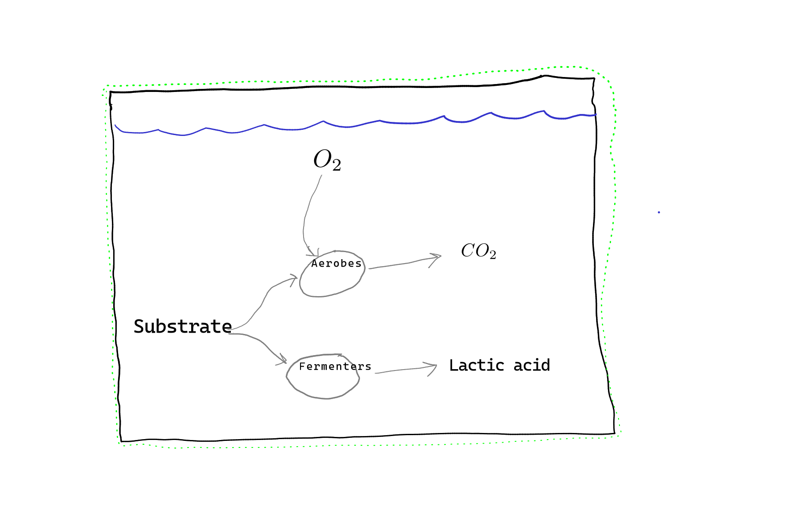
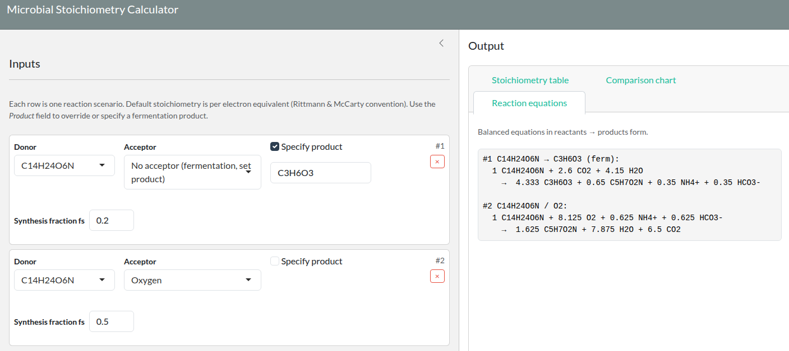

3. Formulate and implement a model for a microbial community consuming milk processing wastewater that includes two groups: aerobic bacteria that use dissolved oxygen to oxidize the wastewater organice matter and fermentative bacteria that produce lactic acid. 
   The reactor runs in batch mode, and you do not need to include aeration; there are no inputs or outputs to the reactor.
   You can use the following empirical formula for the substrate: $\ce{C14H24O6N}$.
   The Microbial Stoichiometry Calculator can be used to sort out stoichiometry: <https://micstoich.com>. 
   For kinetics, use whichever approach you prefer: first-order, second-order, or Monod.
   Use your Python model to predict the effect of initial dissolved oxygen concentration on microbial populations and final lactic acid concentration.


**Solution**

## 1. Conceptual model

We have multiple state variables!

* Substrate
* Dissolved oxygen
* Carbon dioxide
* Lactic acid
* Aerobic bacteria biomass
* Fermentative bacteria biomass



## 2. Balance/conservation equations

We need one for each state variable.
Below they are grouped depending on which terms are relevant

### Substrate and dissolved oxygen
Accumulation = - consumption

### Carbon dioxide and lactic acid
Accumulation = production

### Microbial biomass
Accumulation = growth - death/decay

## 3. Constitutive equations

We need a reaction rate equation for each of the two groups. 
Monod is a good choice for microbial activity. 

For fermenters, with one reactant, the substrate, we can use:

$$
r_{aer} = c_{x_a} \cdot \frac{\hat{q}_{max} \cdot c_s} {c_s + k_s}.
$$

But the aerobic bacteria also has an electron acceptor, oxygen, as an additional reactant.
With multiple reactants, we can combine them like this:

$$
r_{ferm} = c_{x_a} \cdot \hat{q}_{max} \cdot \frac{c_s} {c_s + k_{s,s}} \cdot \frac{c_a} {c_a + k_{s,a}}.
$$

And that is all we need for rates

## 4. Linking equations

Here is where stoichiometry comes in.

Let's follow the advice in the problem and use the Microbial Stoichiometry Calculator.



The reactions are, copied directly and completely:

```
#1 C14H24O6N → C3H6O3 (ferm):
  1 C14H24O6N + 2.6 CO2 + 4.15 H2O
    →  4.333 C3H6O3 + 0.65 C5H7O2N + 0.35 NH4+ + 0.35 HCO3-

#2 C14H24O6N / O2:
  1 C14H24O6N + 8.125 O2 + 0.625 NH4+ + 0.625 HCO3-
    →  1.625 C5H7O2N + 7.875 H2O + 6.5 CO2
```

Let's combine the different inorganic C species and ignore nitrogen species.

```
#1 C14H24O6N → C3H6O3 (ferm):
  1 C14H24O6N + 2.25 CO2 + 4.15 H2O
    →  4.333 C3H6O3 + 0.65 C5H7O2N

#2 C14H24O6N / O2:
  1 C14H24O6N + 8.125 O2
    →  1.625 C5H7O2N + 7.875 H2O + 5.875 CO2
```

Notice that the fermentation reaction seems to require some carbon dioxide?
Let's ignore that, and water, as well!

```
#1 C14H24O6N → C3H6O3 (ferm):
  1 C14H24O6N
    →  4.333 C3H6O3 + 0.65 C5H7O2N

#2 C14H24O6N / O2:
  1 C14H24O6N + 8.125 O2
    →  1.625 C5H7O2N + 5.875 CO2
```

```
#1 C14H24O6N → C3H6O3 (ferm):
  1 C14H24O6N + 2.25 CO2
    →  4.333 C3H6O3 + 0.65 C5H7O2N

#2 C14H24O6N / O2:
  1 C14H24O6N + 8.125 O2
    →  1.625 C5H7O2N + 5.875 CO2
```

Now we can create linking equations.

We have enough complexity here that a matrix approach would be good.

```{python}
import numpy as np

           
#             aero    |  ferm
#           ------------------
# substrate |  -1     | -1     |
#   lactate |   0     |  4.333 |  
#        O2 |   8.125 |  0     |
#       CO2 |   5.875 | -2.25  | 
#       Xaa |   1.625 |  0     |
#       Xaf |   0     |  0.65  |
#           ------------------
import numpy as np
sc = np.array([[-1,     -1    ],
               [ 0,      4.333],
               [ 8.125,  0    ],
               [ 5.875, -2.25 ],
               [ 1.625,  0    ],
               [ 0,      0.65 ]])
sc

print(sc)
```


